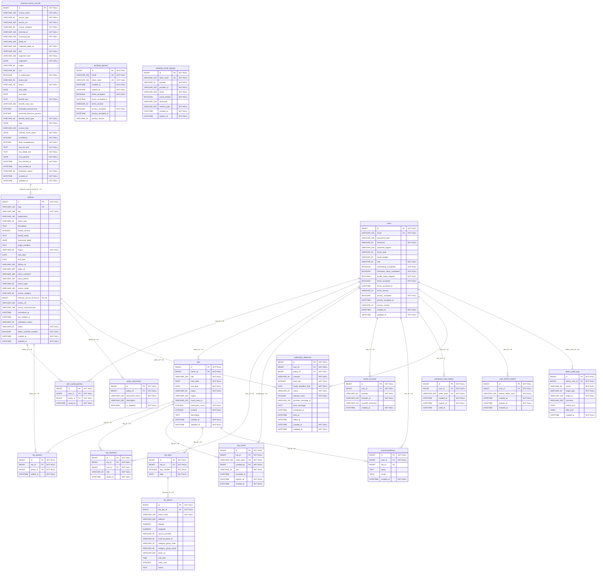

# Travel Hunter DB ERD

## 기준

- 2026-07-11에 코드 기준으로 갱신했다.
- 이 문서의 기준 소스는 `backend/app/models/tables.py`의 SQLAlchemy metadata와 Alembic head `0025_prune_contact_notify`다.
- SQL snapshot 교차 검증 기준은 `docs/db-schema-current.sql`이다. 이전 schema-only snapshot에 Alembic head `0025_prune_contact_notify`의 offline SQL diff를 반영했다. Fresh DB pg_dump 재생성은 별도 검증으로 다시 수행할 수 있다.
- 이 문서는 문서화/시각화 산출물이다. schema, migration, repository, API DTO를 변경하지 않는다.

## 한눈에 보는 테이블 그룹

- **인증/사용자:** `users`, `auth_refresh_tokens`, `social_accounts`, `password_reset_tokens`, `pending_signups`, `pending_social_signups`, `admin_audit_logs`
- **정책:** `policies`, `policy_documents`, `user_saved_policies`, `external_source_records`
- **일정:** `trips`, `trip_days`, `trip_places`, `trip_members`, `trip_policies`, `trip_invites`, `recommendations`
- **알림:** `notification_deliveries`

## ERD 시각화

## 관계 요약

| 부모 테이블 | 자식 테이블 | 외래 키 | 삭제 시 동작 |
| --- | --- | --- | --- |
| `users` | `admin_audit_logs` | `admin_audit_logs.admin_user_id` -> `users.id` | `-` |
| `users` | `auth_refresh_tokens` | `auth_refresh_tokens.user_id` -> `users.id` | `CASCADE` |
| `policies` | `notification_deliveries` | `notification_deliveries.policy_id` -> `policies.id` | `-` |
| `users` | `notification_deliveries` | `notification_deliveries.user_id` -> `users.id` | `CASCADE` |
| `users` | `password_reset_tokens` | `password_reset_tokens.user_id` -> `users.id` | `CASCADE` |
| `external_source_records` | `policies` | `policies.external_source_record_id` -> `external_source_records.id` | `SET NULL` |
| `policies` | `policy_documents` | `policy_documents.policy_id` -> `policies.id` | `CASCADE` |
| `trips` | `recommendations` | `recommendations.trip_id` -> `trips.id` | `-` |
| `users` | `recommendations` | `recommendations.user_id` -> `users.id` | `-` |
| `users` | `social_accounts` | `social_accounts.user_id` -> `users.id` | `CASCADE` |
| `trips` | `trip_days` | `trip_days.trip_id` -> `trips.id` | `CASCADE` |
| `trips` | `trip_invites` | `trip_invites.trip_id` -> `trips.id` | `CASCADE` |
| `users` | `trip_invites` | `trip_invites.created_by` -> `users.id` | `-` |
| `trips` | `trip_members` | `trip_members.trip_id` -> `trips.id` | `CASCADE` |
| `users` | `trip_members` | `trip_members.user_id` -> `users.id` | `-` |
| `trip_days` | `trip_places` | `trip_places.trip_day_id` -> `trip_days.id` | `CASCADE` |
| `policies` | `trip_policies` | `trip_policies.policy_id` -> `policies.id` | `-` |
| `trips` | `trip_policies` | `trip_policies.trip_id` -> `trips.id` | `CASCADE` |
| `users` | `trips` | `trips.owner_id` -> `users.id` | `-` |
| `policies` | `user_saved_policies` | `user_saved_policies.policy_id` -> `policies.id` | `-` |
| `users` | `user_saved_policies` | `user_saved_policies.user_id` -> `users.id` | `CASCADE` |

## 테이블 상세

### `admin_audit_logs`

- 핵심 컬럼: `id`, `admin_user_id`, `created_at`, `action`, `target_type`, `target_id`
- 전체 컬럼: `id` PK, `admin_user_id` FK, `action`, `target_type`, `target_id`, `summary`, `before_json`, `after_json`, `created_at`
- 제약 조건: FK(admin_user_id->users.id); PK(id)
- 인덱스: `ix_admin_audit_logs_action`(action); `ix_admin_audit_logs_admin_user_id`(admin_user_id); `ix_admin_audit_logs_target_id`(target_id); `ix_admin_audit_logs_target_type`(target_type)

### `auth_refresh_tokens`

- 핵심 컬럼: `id`, `user_id`, `created_at`, `expires_at`, `refresh_token_hash`, `revoked_at`
- 전체 컬럼: `id` PK, `user_id` FK, `refresh_token_hash`, `created_at`, `expires_at`, `revoked_at`
- 제약 조건: FK(user_id->users.id; ondelete=CASCADE); PK(id)
- 인덱스: `ix_auth_refresh_tokens_user_id`(user_id)

### `external_source_records`

- 핵심 컬럼: `id`, `source_category`, `canonical_key`, `title`, `status`, `start_date`, `end_date`, `created_at`, `updated_at`
- 전체 컬럼: `id` PK, `source_name`, `source_type`, `source_url`, `source_category`, `external_id`, `canonical_key`, `detail_url`, `collected_page_url`, `title`, `organizer_text`, `organizers`, `region`, `city`, `is_nationwide`, `status_text`, `status`, `start_date`, `end_date`, `benefit_text`, `benefit_value_text`, `extracted_amount_krw`, `extracted_discount_percent`, `benefit_value_type`, `tags`, `contact_text`, `inferred_travel_styles`, `confidence`, `field_completeness`, `raw_list_text`, `raw_detail_text`, `raw_payload`, `last_fetched_at`, `last_verified_at`, `freshness_status`, `created_at`, `updated_at`
- 제약 조건: PK(id); UNIQUE(source_name, source_category, canonical_key)
- 인덱스: `ix_external_source_records_canonical_key`(canonical_key); `ix_external_source_records_end_date`(end_date); `ix_external_source_records_external_id`(external_id); `ix_external_source_records_region`(region); `ix_external_source_records_source_category`(source_category); `ix_external_source_records_source_name`(source_name); `ix_external_source_records_status`(status)

### `notification_deliveries`

- 현재 알림 runtime은 제거되어 이 테이블은 과거 발송 이력/운영 기록용 inert history로만 유지된다. 새 발송 row를 생성하지 않는다.
- 핵심 컬럼: `id`, `user_id`, `policy_id`, `status`, `created_at`, `updated_at`
- 전체 컬럼: `id` PK, `user_id` FK, `policy_id` FK, `channel`, `lead_day`, `target_deadline_date`, `status`, `attempt_count`, `provider_message_id`, `error_message`, `scheduled_at`, `sent_at`, `failed_at`, `created_at`, `updated_at`
- 제약 조건: FK(policy_id->policies.id); FK(user_id->users.id; ondelete=CASCADE); PK(id); UNIQUE(user_id, policy_id, channel, lead_day, target_deadline_date)
- 인덱스: `ix_notification_deliveries_policy_id`(policy_id); `ix_notification_deliveries_user_id`(user_id)

### `password_reset_tokens`

- 핵심 컬럼: `id`, `user_id`, `token_hash`, `created_at`, `expires_at`, `used_at`
- 전체 컬럼: `id` PK, `user_id` FK, `token_hash`, `created_at`, `expires_at`, `used_at`
- 제약 조건: FK(user_id->users.id; ondelete=CASCADE); PK(id)
- 인덱스: `ix_password_reset_tokens_token_hash`(token_hash) UNIQUE; `ix_password_reset_tokens_user_id`(user_id)

### `pending_signups`

- 핵심 컬럼: `id`, `email`, `token_hash`, `created_at`, `expires_at`, `terms_accepted`, `privacy_accepted`
- 전체 컬럼: `id` PK, `email`, `token_hash`, `created_at`, `expires_at`, `terms_accepted`, `terms_accepted_at`, `terms_version`, `privacy_accepted`, `privacy_accepted_at`, `privacy_version`
- 제약 조건: PK(id)
- 인덱스: `ix_pending_signups_email`(email) UNIQUE; `ix_pending_signups_token_hash`(token_hash) UNIQUE
### `pending_social_signups`

- 핵심 컬럼: `id`, `token_hash`, `provider`, `provider_id`, `email`, `created_at`, `expires_at`
- 전체 컬럼: `id` PK, `token_hash`, `provider`, `provider_id`, `email`, `email_verified`, `nickname`, `redirect_path`, `created_at`, `expires_at`
- 제약 조건: PK(id); UNIQUE(provider, provider_id)
- 인덱스: `ix_pending_social_signups_token_hash`(token_hash) UNIQUE
### `policies`

- 핵심 컬럼: `id`, `slug`, `title`, `structured_detail`, `start_date`, `end_date`, `source_category`, `external_source_record_id`, `status`, `created_at`, `updated_at`
- 전체 컬럼: `id` PK, `slug`, `title`, `organization`, `policy_type`, `description`, `benefit_amount`, `benefit_detail`, `structured_detail`, `target_condition`, `region`, `start_date`, `end_date`, `official_url`, `apply_url`, `policy_comment`, `policy_period`, `source_type`, `source_name`, `source_category`, `external_source_record_id` FK, `source_url`, `source_canonical_key`, `normalized_at`, `last_verified_at`, `verification_status`, `status`, `admin_override_enabled`, `created_at`, `updated_at`
- 제약 조건: FK(external_source_record_id->external_source_records.id; ondelete=SET NULL); PK(id)
- 인덱스: `ix_policies_external_source_record_id`(external_source_record_id) UNIQUE; `ix_policies_slug`(slug) UNIQUE; `ix_policies_source_canonical_key`(source_canonical_key); `ix_policies_source_category`(source_category); `ix_policies_source_name`(source_name); `ix_policies_source_type`(source_type)

### `policy_documents`

- 핵심 컬럼: `id`, `policy_id`, `document_name`, `description`, `is_required`
- 전체 컬럼: `id` PK, `policy_id` FK, `document_name`, `description`, `is_required`
- 제약 조건: FK(policy_id->policies.id; ondelete=CASCADE); PK(id)
- 인덱스: -

### `recommendations`

- 핵심 컬럼: `id`, `user_id`, `trip_id`, `created_at`, `query`, `result`
- 전체 컬럼: `id` PK, `user_id` FK, `trip_id` FK, `query`, `result`, `created_at`
- 제약 조건: FK(user_id->users.id); FK(trip_id->trips.id); PK(id)
- 인덱스: -

### `social_accounts`

- 핵심 컬럼: `id`, `user_id`, `provider`, `provider_id`, `created_at`, `provider_nickname`
- 전체 컬럼: `id` PK, `user_id` FK, `provider`, `provider_id`, `provider_nickname`, `created_at`
- 제약 조건: FK(user_id->users.id; ondelete=CASCADE); PK(id); UNIQUE(provider, provider_id)
- 인덱스: -

### `trip_days`

- 핵심 컬럼: `id`, `trip_id`, `day_number`, `date`
- 전체 컬럼: `id` PK, `trip_id` FK, `day_number`, `date`
- 제약 조건: FK(trip_id->trips.id; ondelete=CASCADE); PK(id); UNIQUE(trip_id, date); UNIQUE(trip_id, day_number)
- 인덱스: -

### `trip_invites`

- 핵심 컬럼: `id`, `trip_id`, `invite_token`, `created_by`, `role`, `expires_at`, `created_at`
- 전체 컬럼: `id` PK, `trip_id` FK, `invite_token`, `created_by` FK, `role`, `accepted_at`, `expires_at`, `created_at`
- 제약 조건: FK(created_by->users.id); FK(trip_id->trips.id; ondelete=CASCADE); PK(id)
- 인덱스: `ix_trip_invites_invite_token`(invite_token) UNIQUE; `ix_trip_invites_trip_id`(trip_id)

### `trip_members`

- 핵심 컬럼: `id`, `trip_id`, `user_id`, `role`, `joined_at`
- 전체 컬럼: `id` PK, `trip_id` FK, `user_id` FK, `role`, `joined_at`
- 제약 조건: FK(user_id->users.id); FK(trip_id->trips.id; ondelete=CASCADE); PK(id); UNIQUE(trip_id, user_id)
- 인덱스: -

### `trip_places`

- 핵심 컬럼: `id`, `trip_day_id`, `place_name`, `address`, `latitude`, `longitude`
- 전체 컬럼: `id` PK, `trip_day_id` FK, `place_name`, `address`, `latitude`, `longitude`, `source_provider`, `external_place_id`, `category_group_code`, `category_group_name`, `place_url`, `visit_time`, `order_num`, `memo`
- 제약 조건: FK(trip_day_id->trip_days.id; ondelete=CASCADE); PK(id)
- 인덱스: `ix_trip_places_external_place_id`(external_place_id)

### `trip_policies`

- 핵심 컬럼: `id`, `trip_id`, `policy_id`, `added_at`
- 전체 컬럼: `id` PK, `trip_id` FK, `policy_id` FK, `added_at`
- 제약 조건: FK(trip_id->trips.id; ondelete=CASCADE); FK(policy_id->policies.id); PK(id); UNIQUE(trip_id, policy_id)
- 인덱스: -

### `trips`

- 핵심 컬럼: `id`, `owner_id`, `title`, `start_date`, `end_date`, `status`, `created_at`, `updated_at`
- 전체 컬럼: `id` PK, `owner_id` FK, `title`, `start_date`, `end_date`, `status`, `region`, `travel_area_id`, `participant_count`, `revision`, `description`, `created_at`, `updated_at`
- 제약 조건: FK(owner_id->users.id); PK(id)
- 인덱스: `ix_trips_travel_area_id`(travel_area_id)

### `user_saved_policies`

- 핵심 컬럼: `id`, `user_id`, `policy_id`, `saved_at`
- 전체 컬럼: `id` PK, `user_id` FK, `policy_id` FK, `saved_at`
- 제약 조건: FK(user_id->users.id; ondelete=CASCADE); FK(policy_id->policies.id); PK(id); UNIQUE(user_id, policy_id)
- 인덱스: `ix_user_saved_policies_policy_id`(policy_id); `ix_user_saved_policies_user_id`(user_id)

### `users`

- 핵심 컬럼: `id`, `email`, `role`, `terms_accepted`, `privacy_accepted`, `created_at`, `updated_at`
- 전체 컬럼: `id` PK, `email`, `password_hash`, `nickname`, `preferred_regions`, `travel_style`, `travel_budget`, `role`, `onboarding_completed`, `nickname_setup_completed`, `profile_setup_skipped`, `terms_accepted`, `terms_accepted_at`, `terms_version`, `privacy_accepted`, `privacy_accepted_at`, `privacy_version`, `created_at`, `updated_at`
- 제약 조건: PK(id); UNIQUE(email)
- 인덱스: -

## 기존 schema 기준 문서와의 drift

`docs/db-schema-current.sql`은 기존 schema-only snapshot에서 Alembic head `0025_prune_contact_notify` drop diff를 반영했다. 따라서 현재 체크인된 SQL snapshot에는 이전에 누락됐던 최신 code-head 추가 사항이 포함되어 있다.

- SQLAlchemy metadata에는 있지만 `docs/db-schema-current.sql`에는 없는 application table: 없음.
- `docs/db-schema-current.sql`에는 있지만 SQLAlchemy metadata에는 없는 application table: 없음.
- Migration metadata table인 `alembic_version`은 예상대로 SQL snapshot에만 존재한다.
- `docs/db-schema-current.sql`과 현재 SQLAlchemy metadata를 비교했을 때 컬럼 단위 차이: 없음.

이전에 stale 상태였던 migration 구간 메모:

- `0020_oauth_onboarding_state_flags`는 `users.nickname_setup_completed`, `users.profile_setup_skipped`를 추가한다.
- `0021_legacy_social_nickname`는 데이터 backfill migration이며 schema object를 추가하지 않는다.
- `0022_signup_terms_agreements`는 `users`와 `pending_signups`에 약관/개인정보 동의 컬럼을 추가하고 `pending_social_signups`를 생성한다.
- `0023_policy_structured_detail`은 `policies.structured_detail` JSONB 컬럼을 추가하고 기존 정책 row를 화면용 구조화 섹션 JSON으로 backfill한다. 조건 섹션은 코드의 조건 정제 규칙과 drift가 생기지 않도록 backfill에서는 비워 두고 화면 fallback을 사용한다.
- `0024_local_kst_time_shift`는 timestamp data shift를 수행한다.
- `0025_prune_contact_notify`는 사용자 연락처/OTP/알림 설정 surface와 obsolete user columns를 제거하고 `preferred_regions`를 유지한다.

향후 migration이 추가되면 이 ERD 요약과 `docs/db-schema-current.sql`을 함께 갱신해야 한다.

## 유지해야 하는 아키텍처 불변 조건

- API DTO 필드는 `camelCase`, DB/SQLAlchemy 필드는 `snake_case`를 유지한다.
- `policies.slug`는 정책 상세 route key로 유지한다.
- 일정 route는 내부 숫자형 `trips.id`를 사용한다. `trips.slug`는 도입하지 않는다.
- Schema 생성/변경은 Alembic이 담당한다. 이 문서는 SQLAlchemy `create_all()`을 사용하지 않는다.
